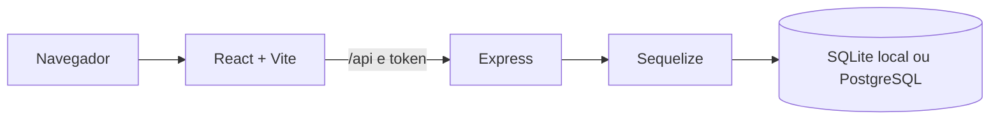

# Arquitetura

## Componentes

O frontend e uma SPA. `HashRouter` usa URLs como `/#/login`, o que evita depender de regras de reescrita no GitHub Pages. A interface usa Tailwind CSS, componentes React e icones Lucide.

## Estrutura do repositorio

| Caminho | Responsabilidade |
| --- | --- |
| `src/main.jsx` | Inicializa React e restaura a sessao. |
| `src/App.jsx` | Declara rotas publicas, protegidas e o layout global. |
| `src/pages/` | Telas de login, dashboard, agenda, residentes, estoque, financeiro e administracao. |
| `src/components/` | Layout, sidebar, modais, protecao de rotas e componentes reutilizaveis. |
| `src/services/` | Cliente Axios, configuracao de API e servicos de dominio. |
| `src/store/authStore.js` | Estado de autenticacao com Zustand. |
| `models/index.js` | Modelos Sequelize e selecao SQLite/PostgreSQL. |
| `server.js` | API Express, health checks, CRUD e entrega da build. |
| `docs/` | Guias de operacao e manutencao. |

## Frontend

As rotas publicas sao `/login` e `/register`. As demais rotas passam por `ProtectedRoute`, que exige sessao autenticada e, quando necessario, uma permissao de modulo.

Rotas de negocio incluem dashboard, agenda, cronograma, censo, prescricoes, residentes, estoque, evolucao, financeiro, comercial, usuarios, empresas, backups, configuracoes e manual. A rota historica `/pacientes` redireciona para `/residentes`.

`src/services/api.js` configura o Axios com `VITE_API_URL`, adiciona o token de sessao do backend e envia `X-Empresa-Id` para superadministradores quando existe uma empresa selecionada.

## Autenticacao e autorizacao

O estado global fica em `authStore`. Ele restaura o token de sessao do backend e carrega o perfil persistido na chave `prescrimed_user` do `localStorage`.

`admin` e `superadmin` possuem acesso a todos os modulos. Outros perfis dependem da lista `user.permissoes`.

## Backend e dados

`server.js` instala CORS, parser JSON, entrega os arquivos de `dist/` e registra rotas REST genericas. Os modelos usam UUID como chave primaria.

No desenvolvimento, se `DATABASE_URL` nao estiver definida, o Sequelize cria ou reutiliza `tmp/dev.sqlite`. Quando `DATABASE_URL` esta definida, o banco passa a ser PostgreSQL. Defina `PGSSLMODE=require` para conexoes SSL.

Os domínios de dados incluem empresas, usuarios, pacientes, prescricoes, agendamentos, enfermagem, fisioterapia, leitos, estoque, financeiro, catalogo, pedidos, pagamentos e notas fiscais. Consulte [API](API.md) para o contrato HTTP exposto hoje.

## Responsividade

O layout prioriza mobile e expande em pontos de quebra do Tailwind. Na tela de login, o painel institucional so aparece a partir de telas `lg`; em telas menores o formulario ocupa toda a largura com margens adaptativas. Componentes de tabela, cards, filtros e navegacao reutilizam utilitarios de `src/index.css` e componentes em `src/components/common/`.
